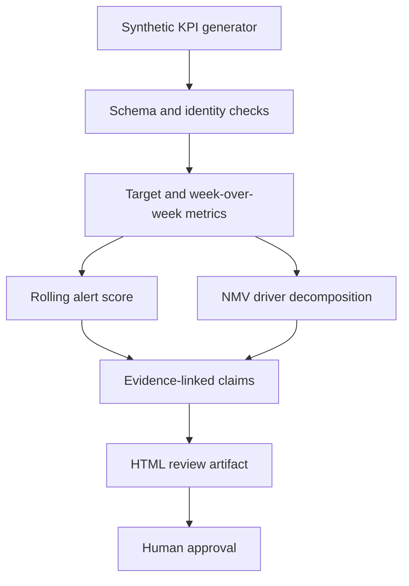

# Agentic Business Review

[](https://github.com/parisaMSTFV/agentic-business-review/actions/workflows/ci.yml)


A reproducible, human-in-the-loop workflow that turns synthetic weekly KPI data into validated business-review evidence, statistical alerts, driver contributions, and review-ready claims.

## Executive summary

Weekly reviews often mix metric calculation, anomaly screening, interpretation, and presentation in one opaque process. This project separates those responsibilities. Deterministic code validates KPI identities and target gaps; a leakage-safe rolling detector screens unusual target residuals; an exact log decomposition attributes weekly NMV movement to sessions, conversion rate, and average order value; and a review layer links every structured claim to source evidence.

On the checked-in synthetic evaluation, the rolling detector identified all 7 injected events with 2 false alerts: precision `0.778`, recall `1.000`, and F1 `0.875`. The fixed 12% target-gap baseline reached F1 `0.833`. All 12 generated claims resolved to valid source identifiers. These results describe this synthetic fixture only; they are not estimates of production accuracy or business impact.

The final HTML artifact can support a review meeting or analyst pre-read, but every claim remains `pending_human_review`. Alerts are signals and the driver decomposition is descriptive, not causal root-cause analysis.

## Business problem

A useful weekly business review must answer four questions without blurring evidence and judgment:

- Which KPIs are ahead of, close to, or behind target after accounting for whether higher or lower is better?
- Which deviations are unusual relative to prior residual behavior rather than merely large in absolute terms?
- How much of the latest NMV movement is associated with traffic, conversion, and order value?
- Can every review statement be traced to the rows and metrics that support it?

## Workflow



The public implementation has no autonomous action, scheduler, report delivery, data-warehouse connector, or live model call. The word *agentic* refers to the staged review workflow and explicit validation boundary, not a production multi-agent platform.

## Dataset

The pipeline generates 64 fictional weekly observations using NumPy seed 42. It includes:

- sessions, orders, conversion rate, average order value, NMV, and service failure rate;
- a target for each KPI;
- stable row identifiers such as `SYN-W064`;
- 7 injected anomalies across sessions, conversion rate, AOV, and service failure rate.

Orders and NMV are derived so that the business identities remain testable. No employer data, customer records, private queries, internal names, or production thresholds were used. See [data provenance](DATA_PROVENANCE.md).

## Methodology

### KPI governance

`configs/metric_catalog.json` stores each KPI's display name, target tolerance, numeric format, and decision direction. A reduction in service failure rate is therefore treated as favorable, while a reduction in sessions is unfavorable. The sign of change alone never determines the status color.

### Leakage-safe alert score

For each monitored metric, the detector first calculates the relative target residual:

$$r_t = \frac{actual_t}{target_t} - 1$$

It then standardizes the current residual against the mean and standard deviation of the previous 12 residuals. The rolling history is shifted by one week, so the current and future observations cannot influence their own reference distribution. An alert is raised when the absolute score is at least 3.5.

### Baseline

The comparison baseline raises an alert whenever the absolute target residual is at least 12%. Keeping this simple rule makes the added value and trade-off of the rolling detector visible: the rolling method recovered two events missed by the baseline, but also produced two false alerts.

### Driver decomposition

The project uses the multiplicative identity:

$$NMV = Sessions \times Conversion\ Rate \times AOV$$

Taking log changes makes the three driver contributions additive and exactly reconcilable, apart from floating-point precision. The latest run's maximum reconciliation error was `2.08e-16`.

### Evidence lineage

Every structured claim stores one or more identifiers in the form `source_row_id:metric`. Validation checks that each identifier exists in the generated evidence index. A traceable claim may still be analytically weak, so traceability does not replace human review.

## Executed results

| Evaluation item | Fixed 12% rule | Rolling residual score |
|---|---:|---:|
| Precision | 1.000 | 0.778 |
| Recall | 0.714 | 1.000 |
| F1 | 0.833 | 0.875 |
| False alerts | 0 | 2 |
| Missed injected events | 2 | 0 |

Additional checks from `reports/metrics.json`:

| Check | Result |
|---|---:|
| Synthetic weeks | 64 |
| Injected labeled events | 7 |
| Schema and identity checks | 10 passed |
| Evidence-linked claims | 12 of 12 |
| Claim-to-source coverage | 100% |
| Core artifact fingerprint | `50a7efa058f05614` |


The rolling detector favors recall in this fixture. That is useful when missed review signals are costly, but the two false alerts show why analyst triage remains necessary.

## Visual results


The diamonds are deliberately injected evaluation events, not detected alerts. This keeps the ground truth visually distinct from the model output.


The chart quantifies contribution to the latest log change. It does not claim that a driver caused the business outcome.

A self-contained [HTML business review](reports/business_review.html) shows the latest KPI cards, structured claims, evidence identifiers, and recent alerts.

## Repository structure

```text
agentic-business-review/
├── configs/metric_catalog.json
├── data/
│   ├── README.md
│   └── synthetic_weekly_kpis.csv
├── docs/interview_guide.md
├── reports/
│   ├── figures/
│   ├── metrics.json
│   ├── alerts.csv
│   ├── claims.csv
│   └── business_review.html
├── scripts/check_sensitive.py
├── src/business_review/
├── tests/
└── .github/workflows/ci.yml
```

## Reproduce the project

Python 3.11 or 3.12 is required.

```bash
python -m venv .venv
source .venv/bin/activate
python -m pip install -e ".[dev]"
make reproduce
make check
```

Windows PowerShell activation:

```powershell
.venv\Scripts\Activate.ps1
```

The reproduction command regenerates the synthetic data, metrics, CSV outputs, HTML review, and all PNG figures. `business-review smoke` runs the complete workflow in a temporary directory without changing checked-in artifacts.

## Tests and quality checks

The test suite covers:

- schema, range, uniqueness, and KPI identity validation;
- higher-is-better and lower-is-better status logic;
- future-data leakage prevention;
- alert metric calculations and baseline behavior;
- exact NMV driver reconciliation;
- claim-to-source traceability;
- deterministic core artifacts across two runs;
- HTML escaping for untrusted labels and claim fields;
- complete pipeline artifact generation.

GitHub Actions runs Ruff, Pytest on Python 3.11 and 3.12, the sensitive-content scan, and a full smoke test. The CI does not require data downloads, secrets, or network APIs.

## Limitations

- Detection metrics come from seven deliberately injected events and are too small for a production-performance estimate.
- The synthetic generator is designed to test the workflow, not reproduce a real company's KPI distribution.
- The 3.5 score threshold and 12-week window are fixed design choices; they were not tuned on a validation period.
- The detector monitors one KPI at a time and does not model correlated failures or regime changes.
- Driver decomposition is accounting-based and cannot establish causality.
- Claim traceability verifies source resolution, not whether a claim is strategically useful.
- Human approval is represented as a required status; no user interface or approval service is implemented.

## Potential next steps

A production-oriented continuation would add time-split threshold selection, multivariate alerting, persistent analyst feedback, and a read-only data contract. Those extensions would need a separately approved, public-safe dataset and should be evaluated before any production claim is made.

## Author

Parisa Mostafavi · [LinkedIn](https://www.linkedin.com/in/parisa-mostafavi/)
